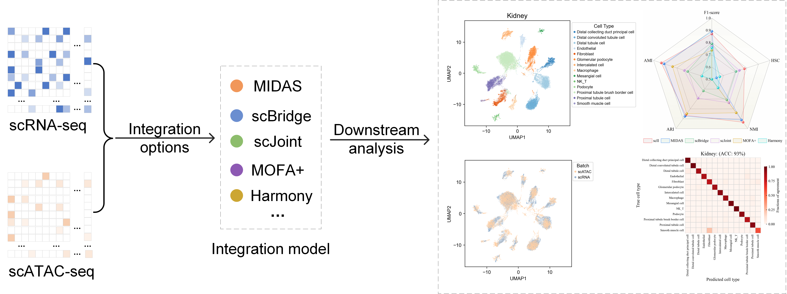

**scII: Dual-Threshold Adaptive Integration of Single-Cell Multi-omics Data Driven by Imputation**

**Graphical Abstract**

The graphical abstract outlines the scII model workflow, which comprises feature extraction using an encoder and self-attention, classification with MLP-Maxout to address dropout events, and cell selection via dynamic Gaussian mixture modeling, culminating in cross-modality integration.

**scII Framework Figure**

scII is an integrative framework consisting of four key modules: the RNA-guided imputation module, the feature extraction and classification module, the cell selection module, and the omics alignment module. 

**Installation**

scII need to install python first, then pytorch and the necessary library files.

**Preparing intput**

The.h5ad file is the input dataset, the expression matrix for scRNA-seq data are the gene expression matrix (either normalised or raw data), and gene actvitiy matrix for scATAC-seq data.

**Running**

`python main.py`

**Output**

Output the value of the evaluation metric and the prompt indicating successful integration in the python terminal.

**Visualisation**

scII_batch.tif, scII_Cluster.tif, scII_CellTypeProbability.tif are respectively the integrated batch map, cell clustering map, and predicted heat map of cell types in scATAC data.
